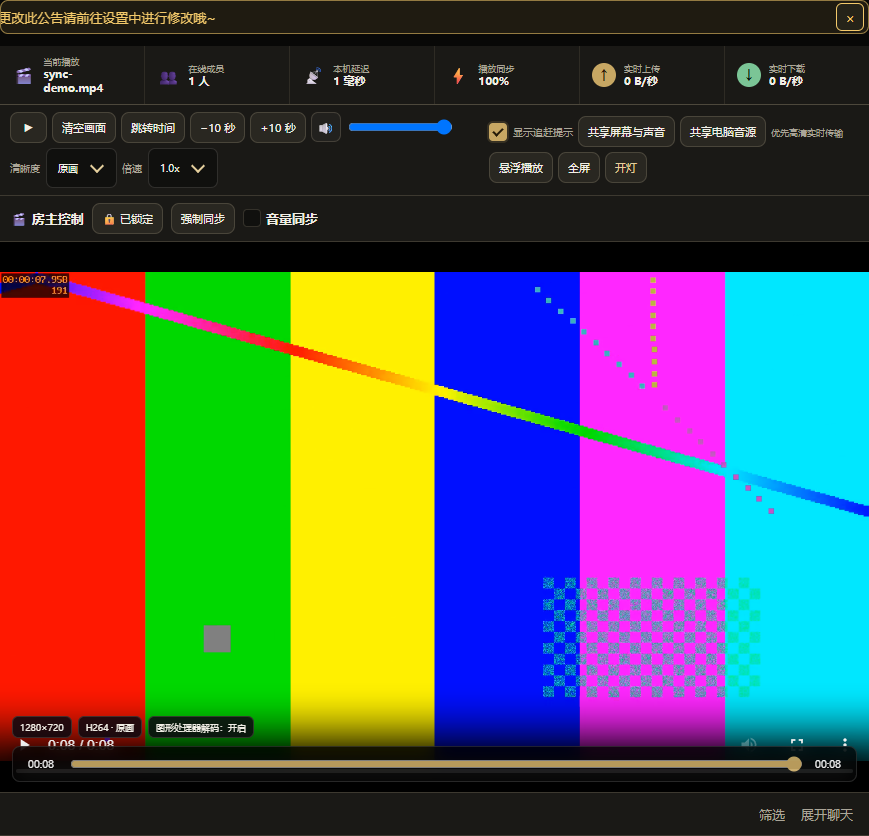
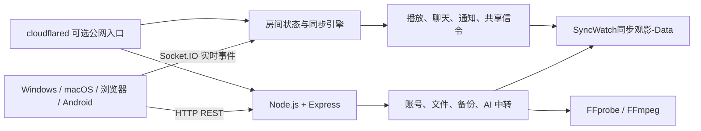

# SyncWatch同步观影

和朋友、家人、情侣远程一起看电影。

SyncWatch 是一个开源、自托管、跨平台的 Watch Party / 同步观影系统。一个人启动服务器，其他人通过 Windows、Android、macOS 或浏览器加入房间，即可同步播放、暂停、拖动进度和倍速，同时支持聊天、弹幕、语音、屏幕共享和媒体管理。

你的服务器、你的影片、你的数据。无需依赖第三方同步观影平台。

[](https://github.com/xuange6610-oss/SyncWatch/releases)
[](https://github.com/xuange6610-oss/SyncWatch/stargazers)
[](https://github.com/xuange6610-oss/SyncWatch/network/members)
[](LICENSE)
[](https://github.com/xuange6610-oss/SyncWatch/actions/workflows/pages.yml)
[](https://github.com/xuange6610-oss/SyncWatch/releases)
[](https://github.com/xuange6610-oss/SyncWatch)



Windows · Android · macOS · Web  ·  同步播放 · 弹幕 · 聊天 · 语音 · 屏幕共享

[立即下载](https://github.com/xuange6610-oss/SyncWatch/releases/latest) · [在线预览](https://xuange6610-oss.github.io/SyncWatch/) · [新手快速开始](docs/quick-start.html) · [部署教程](docs/server-deployment-guide.md) · [GitHub Wiki](https://github.com/xuange6610-oss/SyncWatch/wiki)

> 当前版本：v2.1.6 · 许可证：[Apache-2.0](LICENSE) · 作者：xuan

## 在线参观

打开 [SyncWatch同步观影在线体验入口](https://xuange6610-oss.github.io/SyncWatch/) 可以查看真实登录界面、同步播放画面、管理中心功能导览、数据目录说明、下载入口和新手快速开始；点击页面顶部的“GitHub主页”可以回到源代码仓库。

在线入口已经放在本 README 的“在线参观”小节、仓库右侧 About 的 Homepage 字段，以及展示站顶部导航和首屏按钮中：

- [打开在线体验 / 功能展示](https://xuange6610-oss.github.io/SyncWatch/)
- [打开 GitHub 主页](https://github.com/xuange6610-oss/SyncWatch)


> GitHub Pages 只能托管静态网页。在线入口可以真实展示界面、截图、操作流程和下载说明，但不能在 GitHub 的静态主机上运行 Node.js、WebSocket、文件上传、AI 中转或临时公网访问，也不保存账号和媒体。要实际创建房间、上传影片和邀请成员，请下载服务器版或按照部署教程启动自己的实例。

## 新手应该下载哪个文件

不准备修改代码的用户，请打开 [GitHub Releases](https://github.com/xuange6610-oss/SyncWatch/releases/latest)。不要把仓库首页的 `Source code (zip)` 当成完整安装包。

| 类型 | 适合谁 | 作用 |
| --- | --- | --- |
| Windows 服务器版 | 房主、服务器管理员 | 启动服务、保存数据并打开完整管理界面 |
| Windows 客户端 | 普通成员 | 输入服务器地址后加入房间，不运行完整服务 |
| Android APK | Android 用户 | 加入已有房间；完整包可在受支持设备上运行手机服务器 |
| macOS 服务器/客户端 | Mac 用户 | Intel Mac 使用 x64，Apple Silicon 使用 arm64 |
| 独立服务器 ZIP | Windows/Linux 服务器管理员 | 使用 Node.js 启动服务，适合长期部署和 Docker |
| Source code | 开发者 | 阅读、修改和自行构建，需要安装 Node.js 和依赖 |

Releases 页面只应列出已经真实构建和验证的文件。某个平台没有资产时，表示该版本暂未提供对应成品，请按构建文档自行构建，不要下载名称相似的第三方文件。

## 第一次启动服务器

### 使用服务器 EXE

1. 从 Releases 下载 Windows 服务器版，放进一个普通文件夹。
2. 双击运行。Windows 防火墙询问时，只按你的实际网络环境允许访问。
3. 浏览器会打开 `http://127.0.0.1:5000`；如果端口被占用，以软件显示的地址为准。
4. 使用默认管理员账号 `admin`、密码 `admin888` 登录。
5. 立即进入安全设置修改管理员密码。
6. 创建房间，可以设置房间密码、人数限制和成员权限。
7. 先让同一 Wi-Fi 下的成员使用局域网地址连接，确认成功后再配置公网访问。

### 从源码启动

需要 Git 和 Node.js 22 或更高版本，推荐 Node.js 24 LTS。

```bash
git clone https://github.com/xuange6610-oss/SyncWatch.git
cd SyncWatch
npm ci
npm start
```

只启动独立服务端：

```bash
npm run start:server
```

默认地址是 `http://127.0.0.1:5000`。如果你使用 pnpm：

```bash
corepack enable
pnpm install --frozen-lockfile
pnpm start
```

## 让其他人加入房间

### 同一个 Wi-Fi / 局域网

1. 房主保持服务器运行，不要关闭服务器窗口。
2. 在软件中复制显示的局域网地址，例如 `http://192.0.2.10:5000`。
3. 成员在客户端中填写地址，或直接用浏览器打开。
4. 成员登录或按服务器规则注册，再选择房间。
5. 房主选择影片并开始播放，成员端会跟随共同播放状态。

示例地址使用文档保留网段，实际地址以软件显示为准。

### 跨网络连接

1. 在“服务器设置 > 公网访问”中选择临时公网访问，或配置自己的域名和 HTTPS 反向代理。
2. 源码/独立服务端第一次需要 cloudflared 时，会从 Cloudflare 官方 GitHub Release 下载与系统匹配的文件并校验 SHA-256；完整安装包优先使用内置文件。
3. 等待界面显示 HTTPS 地址并通过连接诊断。
4. 只把成员链接发给可信成员，不公开带房主权限的链接、令牌或管理密码。
5. 临时地址可能在重启后变化；需要固定域名时请阅读服务器部署教程。

## 主要功能

- **同步播放**：房主控制播放、暂停、进度、倍速和可选音量同步，客户端自动校正明显偏差。
- **媒体与字幕**：上传影片、音频、字幕、图片和文档，也可添加合法的 HTTPS 媒体直链。
- **多房间**：支持正式房间、临时房间、房间密码、人数限制和房主/管理员权限。
- **实时交流**：公聊、私聊、弹幕、表情、图片、语音消息、全麦语音和全屏公告。
- **共享能力**：浏览器、Electron 和 Android 屏幕共享；受支持的桌面端可共享电脑音源。
- **账号与管理**：好友、通知、在线状态、设备信息、权限组、封禁、注册审批和操作记录。
- **媒体处理**：FFprobe 分析媒体，FFmpeg 可生成缩略图和 H.264/AAC 浏览器兼容版本。
- **AI 工作台**：可配置兼容 Responses API 或 Chat Completions 的对话、生图和视频接口。
- **运维能力**：数据导入导出、备份恢复、回收站、邮件验证、密码找回、日志和网络诊断。

## 原理与技术架构

SyncWatch同步观影采用“一个自托管服务器，多种客户端共用”的结构。服务器保存账号、房间、媒体和共同播放状态；Windows、Android、macOS 和浏览器只需要连接同一个地址。这样每个成员看到的是同一份房间状态，而媒体和隐私数据仍留在房主自己的设备中。



一次完整操作的实现过程是：

1. Electron、独立 Node.js 服务或 Android 前台服务启动 `server/index.js`，创建 Express HTTP 服务和 Socket.IO 实时通道。
2. 客户端先通过同源页面加载界面，再建立 Socket.IO 连接；登录后服务端校验密码哈希、设备策略、协议版本、房间密码和权限。
3. 房主点击播放、暂停、跳转或倍速时，客户端只发送操作意图；服务端更新权威房间状态，附上时间和版本，再向房间成员广播。
4. 成员端根据服务器时间、网络延迟和本地缓冲计算偏差，超过阈值才校正播放器，避免每次网络抖动都造成画面跳动。
5. 上传使用 HTTP 流式写入，FFprobe 读取编码与时长；浏览器不兼容时由 FFmpeg 生成 H.264/AAC 兼容版本。媒体本体通过 HTTP Range 分段读取，播放状态仍通过 Socket.IO 同步。
6. 配置和业务记录写入 `SyncWatch同步观影-Data/`，敏感材料单独保存在 secrets 目录；写盘使用临时文件与原子替换，同一数据目录只允许一个实例写入。
7. 开启临时公网访问时，`cloudflared` 把本机 HTTP、Socket.IO 和媒体 Range 请求转发到 Cloudflare Edge；它不保存 SyncWatch 的账号和影片，临时网址重启后可能改变。

| 层次 | 使用技术 | 负责什么 |
| --- | --- | --- |
| Web 界面 | 原生 HTML、CSS、JavaScript | 登录、播放器、房间、聊天、管理中心和响应式交互 |
| 核心服务 | Node.js 22+、Express 5、Socket.IO 4 | REST API、认证、房间、实时广播、文件与权限 |
| 桌面端 | Electron 41、electron-builder | 内置 Chromium、服务器窗口、托盘、桌面捕获和便携 EXE |
| Android | Java、C++ JNI、WebView、Node.js Mobile | 手机客户端、屏幕捕获和可选手机服务器 |
| 媒体 | FFprobe、FFmpeg、HTTP Range | 媒体分析、缩略图、字幕、兼容转码和分段播放 |
| 公网访问 | Cloudflare Tunnel / 自有 HTTPS 反向代理 | 把本地服务安全地提供给跨网络成员 |
| 构建与发布 | npm/pnpm、PowerShell、Bash、Gradle、GitHub Actions | 依赖锁定、跨端构建、测试、Release 和 Pages 部署 |

更完整的启动流程、登录时序、媒体处理图、公网隧道图、模块职责、依赖版本、API 边界和平台限制见[技术架构与依赖说明](docs/architecture.md)。在线展示页的[原理与实现动画](https://xuange6610-oss.github.io/SyncWatch/#architecture)会按“启动、连接、认证、处理、持久化、广播”顺序演示这条调用链。

## 数据目录是做什么的

第一次启动会在程序旁创建 `SyncWatch同步观影-Data/`。这里不是源码，而是这台服务器的账号、房间、设置、媒体、聊天和安全材料。迁移服务器时，应先完全退出程序，再复制整个目录。

从旧版升级时，如果程序旁只有 `SyncWatch-Data/`，兼容迁移逻辑会优先保留已有数据。不要因为文件夹名称不同就手工删除旧目录。

| 路径 | 保存内容 | 建议 |
| --- | --- | --- |
| `config.json` | 账号、房间、权限、媒体索引和服务器设置 | 必须备份，不要手工编辑 |
| `chat-history.jsonl` | 聊天、私聊、公告、弹幕和语音记录 | 需要历史记录时备份 |
| `.secrets/`、`secrets/` | 邮件密钥、管理员密码哈希和验证材料 | 绝不能公开，随数据一起备份 |
| `uploads/` | 上传的影片、音频、字幕、图片和文档 | 必须与索引一起备份 |
| `compatible-media/` | 自动生成的浏览器兼容影片 | 可以重建，停机后可清理 |
| `subtitles/`、`thumbnails/` | 转换字幕和缩略图 | 可以重建，建议随媒体备份 |
| `avatars/`、`chat-images/`、`voice/` | 头像、聊天图片和语音消息 | 需要完整记录时备份 |
| `electron-profile/`、`cache/` | 桌面登录状态和网页/图形缓存 | 可以清理，清理后需重新登录 |
| `logs/`、`crash-dumps/` | 运行日志和异常诊断 | 提交 Issue 前先删除隐私信息 |
| `tools/` | 自动准备的 cloudflared 等运行工具 | 缺失时可重新下载，不是业务数据库 |

最简单的备份方法是使用“服务器设置 > 数据导入与导出 > 全部数据与配置”。做磁盘级迁移时必须复制整个目录，只复制 `config.json` 会造成文件或密钥不完整。

## 项目结构

```text
.github/                  Issue、PR 模板和 GitHub Actions
assets/                   应用图标等品牌资源
docs/                     展示站、截图和中文使用/部署文档
mac/                      macOS 发布清单说明
mobile/                   Android 客户端、手机服务器和构建脚本
public/                   实际 Web 界面、样式与客户端逻辑
scripts/                  跨平台构建和发布辅助脚本
server/                   HTTP、Socket.IO、认证、房间、媒体与 AI 中转
tests/                    后端、前端、Electron、Android、隧道和发布验收
build-windows.ps1         Windows 桌面程序构建入口
build-server-package.ps1  独立服务器 ZIP 构建入口
electron-pink.js          Electron 服务器桌面端入口
electron-client.js        Electron 独立客户端入口
server-standalone.js      独立服务端入口
```

Git 没有要求所有文件都必须使用英文名称。仓库采用的规则是：GitHub 约定文件使用标准名称，普通新增文件优先使用小写英文和连字符；面向用户的中文正文和产品名称保持中文。包名、协议字段、Java/JNI 路径和旧数据目录名属于兼容标识，没有迁移方案时不要只改其中一部分。

完整的文件夹、配置文件、启动脚本、构建脚本和测试文件说明见：[仓库文件地图 HTML](docs/repository-map.html) 或 [Markdown 版](docs/repository-map.md)。

## 管理中心功能导览

服务器端登录后，左侧或设置入口中的管理中心按职责拆分为房间、成员、账号、通知、邮件、日志和服务器等模块。每个模块都对应权限检查和操作记录；普通成员看不到服务器管理员专属操作。展示站中的[管理中心图文导览](https://xuange6610-oss.github.io/SyncWatch/#management-center)可以先了解按钮位置和操作顺序。

| 模块 | 主要用途 | 关键操作 |
| --- | --- | --- |
| 房间与上传 | 管理当前房间、媒体、队列和上传审核 | 新建/编辑房间、设置密码、上传影片、审核文件、加入播放队列 |
| 全部房间 | 查看自己有权限进入的正式房和临时房 | 切换房间、置顶、退出、删除自己创建的房间 |
| 成员与权限组 | 查看在线成员和角色权限 | 授予控制权、设置权限组、踢出、封禁、查看设备详情 |
| 聊天与记录 | 管理公聊、私聊、弹幕、语音和操作历史 | 删除消息、清理记录、查看房间操作回溯 |
| 账户与注册 | 管理注册策略、账号资料和登录设备 | 审批注册、修改显示名、重置密码、撤销会话 |
| 用户申请中心 | 集中处理注册、入房、权限和好友申请 | 查看申请详情、同意、拒绝、填写处理备注 |
| 账户权限等级 | 管理等级、经验和功能额度 | 配置等级规则、调整额度、授予或收回特殊权限 |
| 通知/通告设置 | 发布登录提示、房间公告和全屏通告 | 编辑内容、设置停留时间、选择发送范围、撤回公告 |
| 邮件设置 | 配置验证邮件和密码找回邮件 | 填写 SMTP、保存加密配置、发送测试邮件、恢复模板 |
| 日志中心管理 | 查看安全、登录、媒体和管理员操作日志 | 按时间/类型筛选、导出、脱敏后提交 Issue |
| 服务器设置 | 管理端口、局域网、公网隧道、备份和网络诊断 | 启停公网访问、复制地址、导入导出、检查连接 |

逐按钮说明、常见错误和操作示例见：[管理中心详细教程](docs/management-center.md)。

## 文档

- [普通用户使用说明](docs/user-guide.md)
- [服务器部署与使用教程](docs/server-deployment-guide.md)
- [技术架构与依赖说明](docs/architecture.md)
- [macOS 构建说明](docs/macos-build.md)
- [Android 构建说明](mobile/README.md)
- [云端媒体与商业部署说明](docs/cloud-media-deployment.md)
- [管理中心详细教程](docs/management-center.md)
- [管理中心 3D HTML 教程](https://xuange6610-oss.github.io/SyncWatch/management-center.html)
- [常见错误与报错处理](docs/troubleshooting.md)
- [使用技巧与优势](docs/tips-and-advantages.md)
- [发布文件与下载说明](docs/release-artifacts.html)
- [仓库文件地图](docs/repository-map.html)
- [新手快速开始 HTML](docs/quick-start.html)
- [Wiki 完整教程目录](docs/wiki-guide.md) · [仓库内 Wiki 镜像](docs/wiki/)
- [参与贡献](CONTRIBUTING.md)
- [安全报告方式](SECURITY.md)

## 构建与测试

仓库格式、模板和 Pages 检查：

```bash
npm run test:repo
```

核心集成测试：

```bash
npm test
```

完整发布验收：

```bash
npm run test:all
```

构建 Windows 服务器和客户端：

```powershell
powershell -NoProfile -ExecutionPolicy Bypass -File .\build-windows.ps1
```

构建独立服务器包：

```powershell
powershell -NoProfile -ExecutionPolicy Bypass -File .\build-server-package.ps1
```

完整验收可能需要 Electron、FFmpeg、Android SDK/NDK、cloudflared 和对应平台的真实构建环境。缺少环境时，不要把“未运行”写成“测试通过”。

## GitHub Pages 自动部署

工作流位于 [`.github/workflows/pages.yml`](.github/workflows/pages.yml)。推送到 `main` 且 `docs/`、README、许可证或展示站验收发生变化时，会执行：

1. 检出代码；
2. 运行 `node tests/repository-standards.test.js`；
3. 上传 `docs/`；
4. 部署到 GitHub Pages。

仓库所有者第一次使用时，需要在 GitHub 打开 `Settings > Pages`，确认 `Build and deployment` 的来源为 `GitHub Actions`。之后每次合并到 `main` 会自动更新展示站。

## 共同维护与版本更新

任何人都可以 Fork 本仓库、在自己的分支修改代码并提交 Pull Request。`main` 是受保护的稳定分支：贡献者不能直接覆盖，必须经过自动测试和仓库维护者审核；你确认修改符合要求后再合并，合并结果就会成为下一次版本更新的源码基础。

首次参与可以直接阅读[参与贡献指南](CONTRIBUTING.md)。推荐流程是 `Fork → 新建分支 → 修改并测试 → 提交 Pull Request → xuan 审核 → 合并 main → 更新版本与 Release`。这既允许大家共同维护，也能防止未经确认的代码、密钥或破坏性修改直接进入正式版本。

## 安全与使用边界

- 公网部署前必须修改默认管理员密码，并建议设置房间密码。
- 不公开 `SyncWatch同步观影-Data/`、`.env`、签名密钥、邮件密钥或带房主权限的链接。
- Android 正式包必须使用项目所有者自行保管的发布密钥签名，仓库不会提供密钥。
- 只上传、播放和共享自己拥有或已经取得授权的内容。
- 提交 Issue 前删除真实姓名、邮箱、IP、房间号、聊天内容、访问令牌和媒体文件名。
- 安全漏洞请按 [SECURITY.md](SECURITY.md) 私密报告，不要先发公开 Issue。

## 原创与署名说明

SyncWatch同步观影的原创项目设计和本仓库原始实现由 xuan 完成。为了让来源、贡献边界和再发布责任清楚可核验，项目采用 Apache-2.0 发布，并作如下专业说明：

1. **原创来源。** 本仓库中的产品定位、同步观影流程、跨端连接方案、管理中心组织方式、数据目录设计、界面整合和原始代码实现由 xuan 设计或完成；仓库中的历史提交、NOTICE 和许可证用于记录这一来源。
2. **许可证授予的权利。** Apache-2.0 允许任何人依法使用、复制、研究、修改、合并、发布、再许可和销售本项目及其衍生作品，前提是遵守许可证中关于版权、专利和通知的条件。
3. **再发布义务。** 再发布本项目或衍生版本时，必须随附 Apache-2.0 许可证文本，保留原有版权声明和 NOTICE，在修改过的文件中标注修改，并保留适用的专利、商标和来源通知。
4. **不得虚假署名。** 允许改进和商业使用，不等于可以把原始项目或仅作少量修改的版本对外宣称为自己从零原创。宣传、软件关于页和发布说明应准确描述修改范围，并保留 xuan 的原始归属。
5. **商标与名称边界。** Apache-2.0 不自动授予 `SyncWatch同步观影` 名称、图标或品牌的商标权。未经授权，不应让用户误以为衍生版本由 xuan 维护或获得官方支持。
6. **第三方依赖。** 项目依赖、图标、字体、Electron、FFmpeg、cloudflared 和其他第三方组件可能有独立许可证；再发布者必须同时遵守这些组件的许可证，不得把第三方内容冒充为本项目原创。
7. **修改责任。** 修改者应自行验证安全性、平台兼容性、媒体授权、网络配置和数据保护。上游项目不对未经维护者测试的衍生版本、第三方服务器或用户上传内容承担责任。
8. **事实澄清。** 本节用于明确来源和合规要求，不额外限制 Apache-2.0 已经授予的合法权利，也不禁止任何人在许可证范围内建立独立的衍生项目。

## 许可证与联系方式

本项目采用 [Apache License 2.0](LICENSE)，归属信息见 [NOTICE](NOTICE)。

版权所有 © 2026 xuan。

QQ: 2590813506<br>
微信: love_020804


本项目将持续开源，欢迎大家学习、交流和共同改进。如果你在使用过程中发现问题、有新的功能想法，或者希望一起优化代码，都可以联系我沟通。也欢迎提交建议、反馈问题和分享改进方案，希望通过大家共同参与，让项目不断完善，变得更加稳定、实用和好用。
