# SyncWatch同步观影

SyncWatch同步观影是一套可以自己部署的多人同步观影与实时协作系统。一个人运行服务器并创建房间，其他人用 Windows 客户端、Android 客户端或浏览器打开地址，即可同步播放、暂停、进度、倍速和音量，并使用聊天、弹幕、语音、屏幕共享、网页共享等功能。

它既能在同一个 Wi-Fi/局域网内使用，也能通过 Cloudflare Tunnel 或反向代理提供公网访问。服务器数据保存在本机，适合家庭、朋友、社团和需要自主管理数据的团队。

> 当前版本：v2.1.5 · 许可证：[MIT](LICENSE) · 作者：xuan

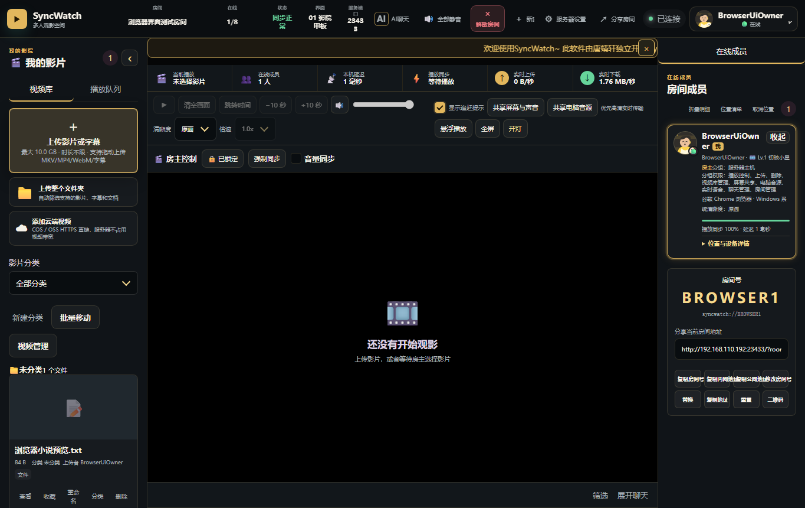

## 直接下载和使用

不准备修改源码的用户，请到 [GitHub Releases](https://github.com/xuange6610-oss/SyncWatch/releases/latest) 下载，不需要下载仓库里的源码压缩包。

| 下载文件 | 适合谁 | 用途 |
| --- | --- | --- |
| `SyncWatch同步观影-v2.1.5.exe` | Windows 房主/服务器管理员 | 启动服务器，同时打开完整桌面管理界面 |
| `SyncWatch同步观影-Client-v2.1.5.exe` | Windows 普通成员 | 输入服务器地址后加入房间，不在本机保存服务器数据库 |
| `SyncWatch同步观影-v2.1.5.apk` | Android 用户 | 加入已有房间，也可以在支持的手机上运行本地服务器 |
| `SyncWatch同步观影-Server-v2.1.5.zip` | Windows/Linux 服务器部署者 | 独立 Node.js 服务端、启动脚本和离线依赖 |
| `SyncWatch同步观影-服务器/客户端-*.dmg/zip` | macOS 用户 | 需要在 macOS 构建机生成并签名；有成品时会放在同一 Release |

### 第一次启动

1. 房主运行 Windows 服务器 EXE。Windows 首次提示时，按实际网络环境允许专用网络访问。
2. 浏览器会打开登录页。初始超级管理员账号是 `admin`，密码是 `admin888`。
3. 登录后立即修改管理员密码，再创建或选择房间。
4. 同一局域网内的成员打开界面显示的 `http://局域网IP:端口` 地址，或在客户端中填写该地址。
5. 公网使用时，在“服务器设置 > 公网访问”开启临时地址或配置稳定 Cloudflare Tunnel。
6. 上传自己有权使用的影片和字幕，房主选择影片后即可同步播放。

服务器、客户端和数据目录建议放在英文或中文均可的普通本地磁盘目录。不要把运行中的数据目录放在会同时同步文件的网盘目录里。

## 界面和主要流程

<table>
  <tr>
    <td><br>登录与房间选择</td>
    <td>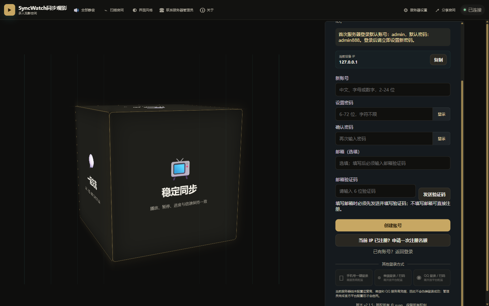<br>账号注册</td>
  </tr>
  <tr>
    <td>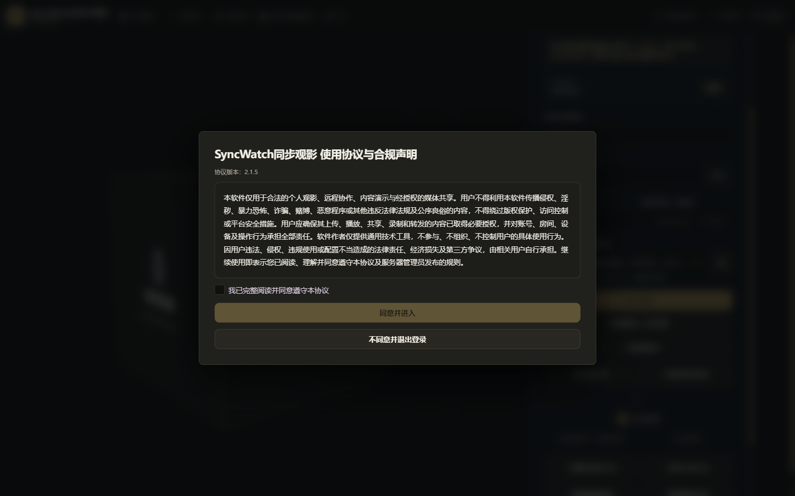<br>首次登录协议</td>
    <td>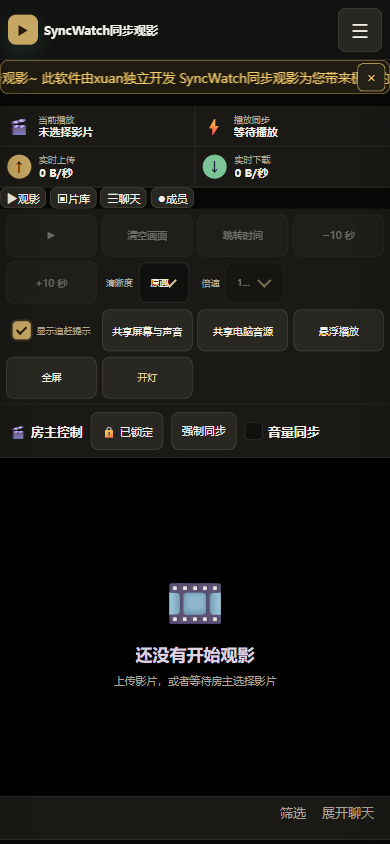<br>移动端播放器</td>
  </tr>
</table>

<table>
  <tr>
    <td>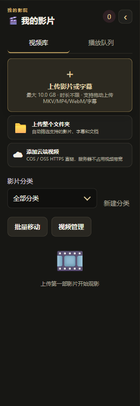<br>上传与媒体库</td>
    <td>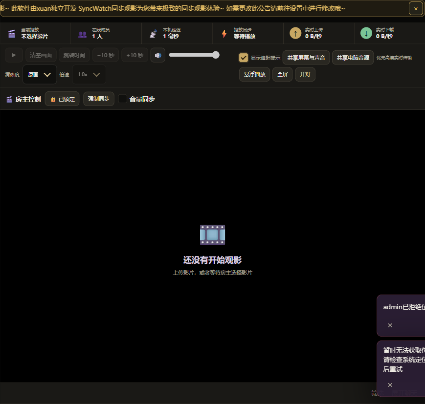<br>同步播放控制</td>
    <td>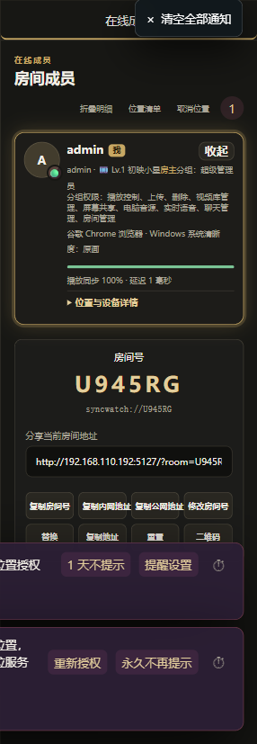<br>成员状态与权限</td>
  </tr>
  <tr>
    <td>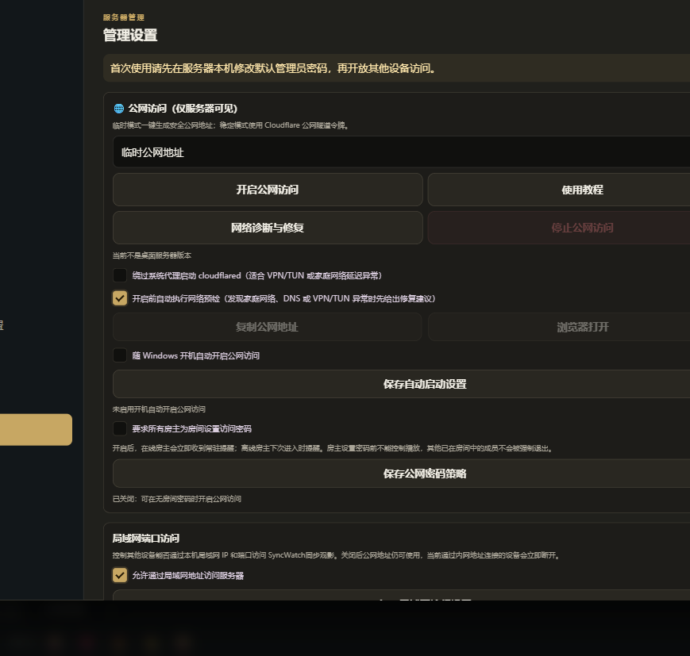<br>聊天、弹幕与语音</td>
    <td>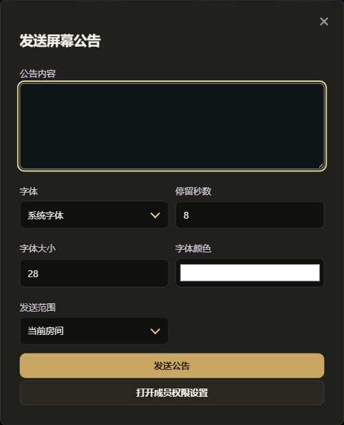<br>全屏公告</td>
    <td>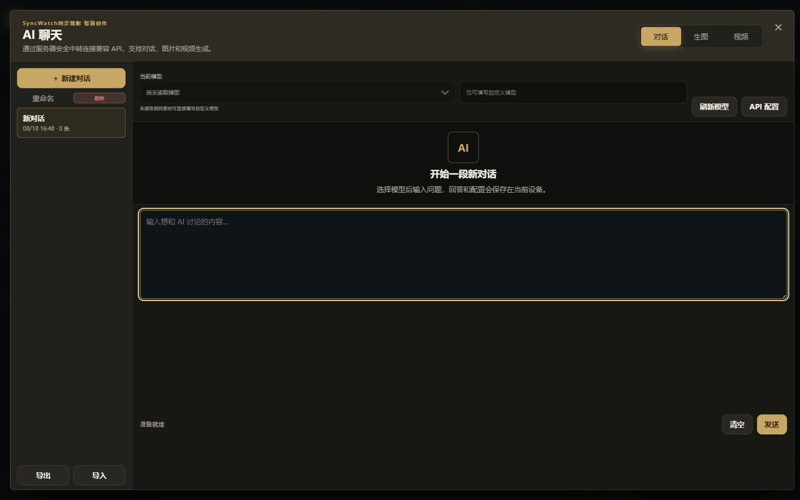<br>AI 对话、生图和视频</td>
  </tr>
</table>

<table>
  <tr>
    <td>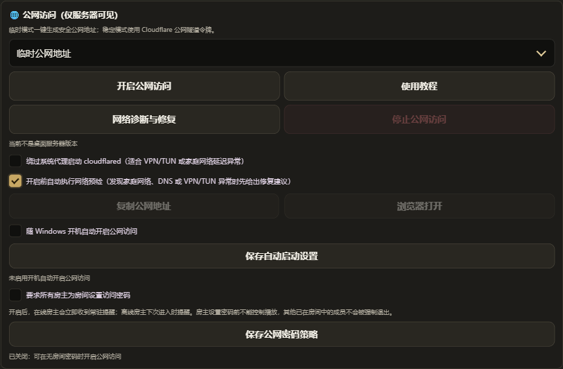<br>公网访问与网络诊断</td>
    <td>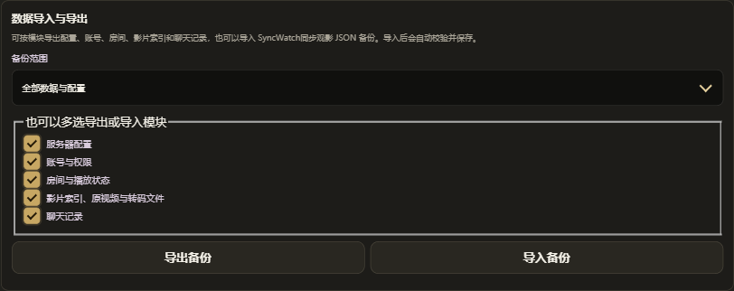<br>按模块备份与恢复</td>
  </tr>
</table>

## 功能说明

- **同步播放**：房主统一控制播放、暂停、时间、倍速和可选的音量同步；客户端会自动追赶房主进度。
- **媒体库**：上传影片、音频、字幕、图片和文档，也可添加 COS/OSS 的 HTTPS 视频直链。
- **多房间**：支持正式房间、临时房间、房间密码、人数限制、房主和管理员权限。
- **实时交流**：房间聊天、私聊、弹幕、表情、图片、语音消息、全麦语音和全屏公告。
- **多端共享**：浏览器、Electron 和 Android 屏幕共享，桌面端还支持共享电脑音源。
- **成员管理**：好友、通知、在线状态、设备信息、权限组、封禁、注册审批和审计记录。
- **媒体处理**：FFprobe 分析媒体，FFmpeg 生成缩略图和 H.264/AAC 浏览器兼容版本。
- **外观适配**：21 套响应式界面风格，覆盖桌面、手机、平板和电视浏览器。
- **AI 工作台**：兼容 Responses API / Chat Completions，可配置对话、生图和视频接口。
- **运维能力**：数据导入导出、回收站、操作历史、邮件验证、密码找回、日志和网络诊断。

## 数据目录是做什么的

首次启动会在程序旁创建 `SyncWatch同步观影-Data/`。这里不是源码，而是这台服务器的数据库、账号、媒体和密钥。迁移服务器时，应先完全退出程序，再整体复制此目录。

从旧版升级时，如果程序旁只有 `SyncWatch-Data/`，新版会自动将它改名为 `SyncWatch同步观影-Data/`；如果系统权限导致改名失败，程序会继续使用旧目录，不会新建空数据库让账号和影片看起来“丢失”。

它不是 MySQL 这类需要单独安装的数据库。可以把它理解为三层：`config.json` 和 `chat-history.jsonl` 保存可检索的账号、房间、设置与聊天记录；`uploads/` 等目录保存这些记录引用的实际文件；`.secrets/` 和 `secrets/` 保存解密邮件配置、验证管理员身份所需的安全材料。只复制其中一层会造成记录、文件或密钥不完整，因此迁移和完整备份应复制整个目录。

| 路径 | 保存内容 | 处理建议 |
| --- | --- | --- |
| `config.json` | 账号、房间、权限组、影片索引、收藏、观看历史和服务器设置 | **必须备份**，不要手工编辑 |
| `chat-history.jsonl` | 聊天、私聊、公告、弹幕、语音和图片消息记录 | 需要历史记录时必须备份 |
| `.secrets/` | 邮件授权码等敏感信息的本机加密密钥 | **绝不能公开**，应和数据库一起备份 |
| `secrets/` | 超级管理员密码哈希，不保存明文密码 | **绝不能公开**；删除会触发管理员重置流程 |
| `uploads/` | 用户上传的原始影片、音频、字幕、图片和文档 | **必须备份**，影片索引会引用这些文件 |
| `compatible-media/` | 自动生成的 H.264/AAC 兼容影片 | 可重新生成；空间不足且程序已退出时可清理 |
| `subtitles/` | 转换后的 WebVTT 字幕 | 可重新生成，建议随媒体一起备份 |
| `thumbnails/` | 影片缩略图 | 可重新生成 |
| `avatars/` | 用户上传的头像 | 需要保留头像时备份 |
| `chat-images/`、`voice/` | 聊天图片和语音消息 | 需要完整聊天记录时必须备份 |
| `login-cube/`、`login-cube-model/` | 登录页六面图和自定义 GLB 模型 | 使用自定义登录页时备份 |
| `login-music/`、`login-video/` | 登录页自定义音乐和视频 | 使用自定义登录页时备份 |
| `trash/` | 可回溯操作对应的临时回收站 | 会按保留期自动清理，不应当作正式备份 |
| `electron-profile/` | PC 端登录状态、Web 存储和本机偏好 | 可清理；清理后需要重新登录 |
| `cache/` | Electron 网页、图形和媒体缓存 | 程序退出后可清理，会自动重建 |
| `logs/`、`crash-dumps/` | 运行日志和异常诊断文件 | 排障后可清理，提交 Issue 前先检查隐私 |
| `tools/` | 程序下载或准备的媒体处理工具 | 缺失时可重新准备，不含业务数据库 |
| `.syncwatch-instance.lock/` | 防止两个进程同时写坏同一数据目录的运行锁 | 正常退出会自动删除；不要在程序运行时删除 |
| `server-config.json` | 独立服务器启动端口和公网地址等设置 | 建议备份 |
| `服务器运行信息.txt` | 独立服务器生成的访问地址和运行提示 | 可能包含内网/公网地址，不要随意公开 |
| `数据目录说明.txt` | 程序自动生成的同类说明 | 升级时会自动更新 |

安全备份的最简单方法是使用“服务器设置 > 数据导入与导出 > 全部数据与配置”。做磁盘级迁移时，应在程序完全退出后复制整个数据目录，不要只复制 `config.json`。

## 从源码运行

需要 Node.js 22 或更高版本，推荐 Node.js 24 LTS。

```bash
npm ci
npm start
```

只启动独立服务端：

```bash
npm run start:server
```

默认地址为 `http://127.0.0.1:5000`。也可使用项目锁定的 pnpm：

```bash
corepack enable
pnpm install --frozen-lockfile
```

## 项目结构

```text
public/                 Web 界面、样式与客户端逻辑
server/                 HTTP、Socket.IO、认证、房间、媒体与 AI 中转
mobile/                 Android 客户端、手机服务端与构建脚本
mac/                    macOS 发布清单和说明
scripts/                跨平台构建与发布辅助脚本
tests/                  接口、媒体、Electron、Android 与隧道验收
docs/screenshots/       README 使用的真实界面截图
electron-pink.js        Electron 服务器桌面端入口
electron-client.js      Electron 独立客户端入口
server-standalone.js    独立服务端入口
```

公开仓库只保存源码、锁文件、必要资源和文档。依赖目录、运行数据、Android 签名密钥、Node.js Mobile 二进制、`cloudflared` 和构建成品不会进入 Git 历史；成品通过 GitHub Releases 单独发布。

## 构建、部署和测试

- [普通用户使用说明](使用说明.md)
- [服务器部署与使用教程](服务器部署与使用教程.md)
- [技术架构与依赖说明](技术架构与依赖说明.md)
- [macOS 构建说明](MACOS-BUILD.md)
- [Android 构建说明](mobile/README.md)
- [云端视频与商业部署说明](云端视频与商业部署说明.md)

核心集成测试：

```bash
npm test
```

完整发布验收：

```bash
npm run test:all
```

完整验收涉及 Electron、真实媒体转码、Android、Cloudflare Tunnel 和平台成品，需要按构建文档准备对应工具。纯源码检出可以直接运行核心测试和各个 `--source-only` 检查。

## 安全与使用边界

- 公网部署前必须修改默认管理员密码，并建议为房间设置访问密码。
- 不要公开 `SyncWatch同步观影-Data/`、`.env`、签名密钥、邮件密钥或带 `#host=` 的房主链接。
- Android 正式包必须使用项目所有者自行保管的发布密钥签名，仓库不会提供密钥。
- 只上传、播放和共享自己拥有或已经取得授权的内容。
- 提交 Issue 前请去掉真实姓名、邮箱、IP、房间号、聊天内容、访问令牌和媒体文件名。

发现安全问题时，不要在公开 Issue 中粘贴可直接利用的生产环境信息。

## 许可证

本项目采用 [MIT License](LICENSE)，版权所有 © 2026 xuan。
