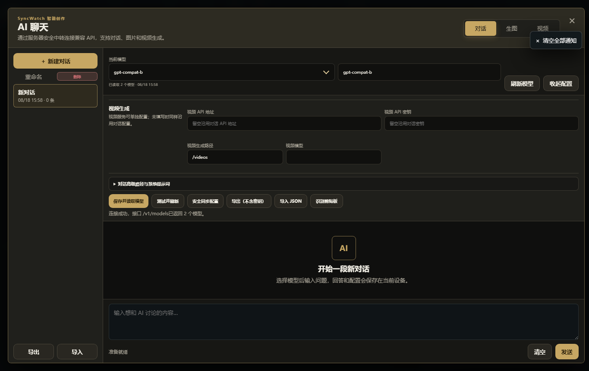

# SyncWatch 同步观影

SyncWatch 是一套可自托管的多人同步观影与实时协作系统。它提供 Windows Electron 桌面端、响应式 Web 客户端、Android 客户端与独立 Node.js 服务端，支持局域网运行，也可通过反向代理或 Cloudflare Tunnel 提供公网访问。


## 主要功能

- 多房间同步播放、暂停、进度、倍速、音量与缓冲状态
- 视频、字幕、文件夹和 COS/OSS HTTPS 直链媒体
- 公聊、私聊、弹幕、语音、好友、通知与全屏公告
- Electron、浏览器和 Android 屏幕共享，以及网页共享
- 房主、房间管理员和服务器超级管理员分级权限
- FFprobe 媒体分析、FFmpeg 缩略图与浏览器兼容转码
- 21 套响应式界面风格，覆盖桌面、手机、平板与电视浏览器
- 兼容 Responses API / Chat Completions 的 AI 对话、生图和视频工作台
- 数据备份迁移、回收站、操作历史、邮件验证与密码找回

<table>
  <tr>
    <td></td>
    <td></td>
  </tr>
</table>

## 技术栈

- 服务端：Node.js、Express、Socket.IO
- Web：原生 HTML、CSS、JavaScript
- 桌面端：Electron
- Android：Java、WebView、Node.js Mobile、JNI/C++
- 媒体：FFmpeg、FFprobe
- 部署：Windows、Linux x64、Docker Compose、Nginx/Caddy

前端不依赖 React、Vue 等框架，也不依赖外部 CDN。桌面浏览器、Electron 和 Android WebView 共用 `public/` 中的界面与业务代码。

## 快速开始

需要 Node.js 22 或更高版本，推荐 Node.js 24 LTS。

```bash
npm ci
```

启动 Electron 桌面端：

```bash
npm start
```

只启动独立服务端：

```bash
npm run start:server
```

默认访问地址为 `http://127.0.0.1:5000`。首次启动会在项目旁创建 `SyncWatch-Data/`；服务器超级管理员初始账号为 `admin`，初始密码为 `admin888`，首次登录后应立即修改。

也可以使用项目锁定的 pnpm：

```bash
corepack enable
pnpm install --frozen-lockfile
```

## 测试

核心集成测试：

```bash
npm test
```

完整发布验收包含 Electron、真实媒体转码、Android、Cloudflare Tunnel 和各平台成品检查：

```bash
npm run test:all
```

完整验收需要按构建文档准备本机平台工具和发布产物；纯源码检出可直接运行核心集成测试与各个 `--source-only` 检查。

## 项目结构

```text
public/                 Web 界面、样式与客户端逻辑
server/                 HTTP、Socket.IO、认证、房间、媒体与 AI 中转
mobile/                 Android 客户端、手机服务端与构建脚本
tests/                  接口、媒体、Electron、Android 与隧道验收
scripts/                跨平台构建和发布辅助脚本
electron-pink.js        Electron 主入口
server-standalone.js    独立服务端入口
```

仓库只保存源码、锁文件、必要资源和文档。依赖目录、运行数据、Android 签名密钥、Node.js Mobile 二进制、`cloudflared`、EXE、APK、ZIP 和 DMG 均不会进入 Git 历史。

## 构建与部署

- [使用说明](使用说明.md)
- [服务器部署与使用教程](服务器部署与使用教程.md)
- [技术架构与依赖说明](技术架构与依赖说明.md)
- [macOS 构建说明](MACOS-BUILD.md)
- [Android 构建说明](mobile/README.md)
- [云端视频与商业部署说明](云端视频与商业部署说明.md)

Android 正式包必须使用项目所有者自行保管的发布密钥签名。公开仓库不提供签名密钥、历史服务器数据或任何真实服务凭据。

## 安全提示

- 公网部署前应修改默认管理员密码，并为房间配置访问密码。
- `SyncWatch-Data/` 包含账号、聊天、媒体索引和加密密钥，迁移和备份时必须整体处理。
- 不要公开带有 `#host=` 的服务器房主入口。
- 网页共享、屏幕共享和媒体上传应只用于你拥有或获授权的内容。

发现安全问题时，请不要在公开 Issue 中提交密钥、个人数据或可直接利用的生产环境信息。

## 许可证

本项目采用 [MIT License](LICENSE)，版权所有 © 2026 xuan。
